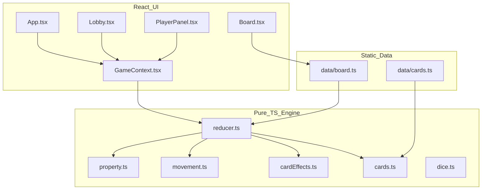

# Actuarialopoly — Agent Handover

**Last updated:** 2026-05-29  
**Repo:** `crosby0821/cursor-test`  
**Active branch:** `cursor/actuarial-monopoly-d386`  
**Draft PR:** https://github.com/crosby0821/cursor-test/pull/1  
**Plan (read-only):** `/opt/cursor/artifacts/plans/actuarial_monopoly_web_ba4dd830.plan.md` — **do not edit** unless the user asks.

---

## 1. Executive summary

**Actuarialopoly** is a browser-based, actuarially themed property board game (Monopoly-style mechanics, non-Hasbro branding). MVP is **complete** for v1 scope: local pass-and-play, 2–4 players, 40-tile board, full turn loop, cards, jail, insolvency, win detection.

The next agent should treat this as **maintain and extend**, not greenfield, unless the user requests a rewrite.

---

## 2. Quick commands

```bash
cd /workspace   # or clone and checkout branch below
git checkout cursor/actuarial-monopoly-d386
npm install
npm run dev      # http://localhost:5173
npm run test     # 16 tests (Vitest)
npm run build    # tsc + vite → dist/
npm run preview  # serve production build
```

**Cloud agent git rules (if applicable):**

- New branches: `cursor/<descriptive-name>-d386`
- Push: `git push -u origin <branch>`
- Base branch for PRs: `main`

---

## 3. Architecture



| Layer | Path | Notes |
|-------|------|--------|
| UI | `src/components/`, `src/App.tsx` | No game rules in components; dispatch actions only |
| State | `src/context/GameContext.tsx` | `useReducer(gameReducer, createInitialState)` |
| Rules | `src/game/reducer.ts` | **~600 lines** — main phase machine; largest file |
| Board/cards data | `src/data/board.ts`, `src/data/cards.ts` | 40 tiles, 16+16 card definitions |
| Styles | `src/styles/game.css` | Dark theme; board is 11×11 CSS grid |
| Tests | `src/game/*.test.ts` | 5 test files, 16 tests |

**Important:** `src/game/turn.ts` and `src/game/bankruptcy.ts` exist to match the plan layout but are **thin helpers**; turn transitions and liquidation logic live in **`reducer.ts`**.

---

## 4. What is implemented (v1)

### Product

- [x] **Actuarialopoly** title + subtitle (no “Monopoly” trademark in UI)
- [x] Lobby: 2–4 players, names, $1500 start
- [x] Pass-and-play on one device
- [x] 40-tile board with actuarial names (22 properties, 4 railroads, 2 utilities)
- [x] Premium Collection Day: `$200 + $10 ×` fully controlled segments
- [x] Underwrite / pass on unowned lines (no auction UI)
- [x] Claims (rent) with exposure tiers and monopoly segment rules
- [x] Build/sell exposure ($50 build, $25 sell return)
- [x] Reinsurance cession (50% mortgage) / recover (110%)
- [x] Stochastic + Industry card decks (shuffle, draw, resolve)
- [x] Regulatory examination (jail): doubles, $50 fine, jail cards
- [x] Triple doubles → jail
- [x] Taxes → free parking pool (pool displayed; **no payout rule** on Free Parking)
- [x] Adverse development on rent (volatility-based chance)
- [x] MCR hint in UI (`0.1 × totalAssets`)
- [x] Insolvency phase: liquidate, try pay again, declare insolvent
- [x] Win: last solvent player
- [x] Event log (last **5** events)
- [x] README glossary + manual verification checklist

### Tests

| File | Covers |
|------|--------|
| `dice.test.ts` | Injectable RNG |
| `property.test.ts` | Go premium, rent tiers, property init |
| `reducer.test.ts` | Start game, roll, third double → jail |
| `cardEffects.test.ts` | Card calcs + RESOLVE_CARD collect |
| `bankruptcy.test.ts` | Insolvency helpers + DECLARE_INSOLVENT |

---

## 5. Gaps vs original plan (intentional or incomplete)

| Plan item | Status | Notes |
|-----------|--------|--------|
| `cardEffects.ts` for all effects | **Partial** | Pure calcs in `cardEffects.ts`; **`applyCardEffect` still in `reducer.ts`** |
| `turn.ts` phase machine | **Stub** | `canRoll` / `canBuildOrManage` only; phases enforced in reducer |
| `bankruptcy.ts` trades | **Stub** | `canPayAmount` helpers; no player-to-player trades |
| `restructureUsed` once per game | **Not enforced** | Field on `Player` set `false` at start, never flipped |
| `localStorage` resume | **Not implemented** | Plan stretch goal |
| Free Parking house rule | **Partial** | Taxes add to `freeParkingPool`; landing on parking does nothing |
| Auction on declined buy | **Out of scope** | Pass only |
| AI opponents | **Out of scope** | — |
| Online multiplayer | **Out of scope** | — |
| PR screenshots/GIF | **Missing** | Draft PR #1 has no board images yet |
| `npm run lint` | **Present** | Not run in CI by default |

---

## 6. Game state model (for debugging)

### Key types — `src/game/types.ts`

- `GamePhase`: `preRoll` \| `buyPrompt` \| `payRent` \| `cardReveal` \| `insolvency` \| `gameOver`
- `GameState`: players, `properties` map, decks, `pendingBuy` / `pendingRent` / `pendingCard`, `consecutiveDoubles`, `lastDice`, `log`, `winnerId`

### Actions — `GameAction` (dispatch from UI)

| Action | When |
|--------|------|
| `START_GAME` | Lobby |
| `ROLL_DICE` | `preRoll` (and jail sub-flow) |
| `BUY_PROPERTY` / `DECLINE_BUY` | `buyPrompt` |
| `PAY_RENT` | `payRent` |
| `RESOLVE_CARD` | `cardReveal` |
| `BUILD_EXPOSURE` / `SELL_EXPOSURE` | Anytime current player owns line (panel) |
| `MORTGAGE` / `UNMORTGAGE` | Owner actions |
| `PAY_JAIL_FINE` / `USE_JAIL_CARD` | In jail |
| `END_TURN` | Manual skip when not doubles |
| `RAISE_CAPITAL_DONE` / `DECLARE_INSOLVENT` | Insolvency |
| `SELL_ASSETS_TO_BANK` | Insolvency liquidation |

### Turn flow quirks (read before changing reducer)

1. **Doubles:** After buy/decline/rent, `endTurnIfNeeded(s, extraRoll)` may keep same player on `preRoll` if `lastDice.isDoubles` and `consecutiveDoubles < 3`.
2. **Third double:** `consecutiveDoubles >= 3` → jail; `lastDice` preserved on jailed state (fixed in commit `5ebd1e0`).
3. **Utilities:** Rent needs `lastDice` on state when landing; uses `dice.total × multiplier`.
4. **Advance-to-railroad cards:** Do **not** apply classic “double rent if unowned” rule.
5. **RNG in tests:** Always mock `Math.random` **after** `START_GAME` (shuffle consumes mocks otherwise).

---

## 7. File map (where to edit what)

| Task | Start here |
|------|------------|
| Rename tiles / prices / rent | `src/data/board.ts` |
| Card text / effects | `src/data/cards.ts` + `applyCardEffect` in `reducer.ts` |
| New rules (e.g. Free Parking payout) | `reducer.ts` → `resolveLanding` |
| Rent / Go / exposure math | `src/game/property.ts` |
| UI copy / buttons | `src/components/PlayerPanel.tsx` |
| Board layout / tile positions | `src/components/BoardTile.tsx` → `getTileGridStyle` |
| Constants ($200 Go, jail fine, etc.) | `src/game/constants.ts` |
| New tests | Mirror module under `src/game/*.test.ts` |

---

## 8. Git history (recent)

```
d173808 Add turn.ts and bankruptcy.ts modules with verification tests
3b896ef Add cardEffects module with tests and README manual verification checklist
6d01dbd Fix reducer test RNG mock order; event log cap at 5
5ebd1e0 Fix flaky dice test; preserve lastDice on triple doubles
6490aba Implement Actuarialopoly web game (main MVP)
318a2a6 Initial commit (README only)
```

**`main`** still only has the initial README; all game code is on the feature branch until PR #1 merges.

---

## 9. Recommended next steps (priority order)

### P0 — Polish before merge

1. **Manual playtest** using README “Manual verification” section; fix UX bugs in `PlayerPanel` (button visibility vs `phase`).
2. **Add PR screenshot** of board in GitHub PR #1 description (user-facing polish).
3. Run `npm run lint` and fix any issues.

### P1 — Plan fidelity / gameplay

1. **Free Parking:** On landing, pay out `freeParkingPool` to player (optional house rule toggle).
2. **`restructureUsed`:** Enforce one “restructure” attempt before forced insolvency when capital &lt; 0.
3. **Refactor `applyCardEffect`** out of `reducer.ts` into `cardEffects.ts` (return `GameState` patch or action list) for testability.
4. **Trade between players** (if desired) — not in v1 plan but common Monopoly feature.

### P2 — Out of scope v1 (user must request)

- AI opponents (`src/game/ai.ts` + heuristic buy/build)
- Online multiplayer (WebSocket / server)
- Full auction UI
- `localStorage` save/resume
- i18n, sound, animations

### P3 — Engineering

- Split `reducer.ts` into `turn.ts` + `landing.ts` + `cardEffects.ts` (reduce file size)
- E2E smoke test (Playwright): lobby → start → one roll
- GitHub Actions: `test` + `build` on PR
- Deploy `dist/` to GitHub Pages or static host

---

## 10. Known issues / tech debt

| Issue | Severity | Detail |
|-------|----------|--------|
| Monolithic reducer | Medium | Hard to navigate; high regression risk without tests |
| `turn.ts` unused in UI | Low | Helpers exist but `PlayerPanel` duplicates phase checks |
| Vite scaffold cruft | Low | `src/App.css`, `src/assets/hero.png`, default favicons may be unused |
| `Read` tool path quirks | Env | Some agent turns had “file not found” for `/workspace/...` while shell worked; use shell `cat` if needed |
| Flaky tests if RNG mocked before `START_GAME` | Low | Documented; fixed in `reducer.test.ts` |

---

## 11. Verification checklist (hand to next agent)

Before claiming “done” on any task:

```bash
npm run test    # expect 16/16 pass
npm run build   # expect clean tsc + vite build
```

Manual smoke:

1. Start 2-player game.
2. Roll, buy a property, end/pass turn.
3. Trigger a card space and resolve.
4. Confirm event log updates and turn advances.

---

## 12. User preferences (from session)

- **Do not edit** the plan artifact unless asked.
- Use existing todos; mark `in_progress` → `completed` (do not recreate todo list).
- Branch naming: `cursor/<name>-d386` for new cloud agent branches.
- Branding: **Actuarialopoly**, not “Monopoly”.
- Prefer minimal, focused diffs; match existing code style.

---

## 13. Contacts / links

| Resource | URL |
|----------|-----|
| GitHub repo | https://github.com/crosby0821/cursor-test |
| Draft PR | https://github.com/crosby0821/cursor-test/pull/1 |
| Plan artifact | `actuarial_monopoly_web_ba4dd830.plan.md` (Cursor artifacts path) |

---

## 14. One-paragraph pitch for stakeholders

Actuarialopoly is a pass-and-play web board game for 2–4 players where actuaries underwrite insurance lines, collect premiums at Go, pay claims as rent, build exposure tiers, manage reinsurance cession, and draw stochastic/industry event cards. The engine is a pure TypeScript reducer tested with Vitest; the UI is React + Vite. v1 is playable end-to-end on branch `cursor/actuarial-monopoly-d386`, pending merge of PR #1.
